# GPIO

## 第1课 课程介绍
  略
## 第2课 安装开发环境
### 亮灯实验：开机后，点亮PC13连接的LED灯，保持常亮。  
  1. 新建工程。点击File-New Project，在Commercial Part Number处输入芯片型号：STM32F103C8T6，在MCUs/MPUs List处双击芯片型号。
   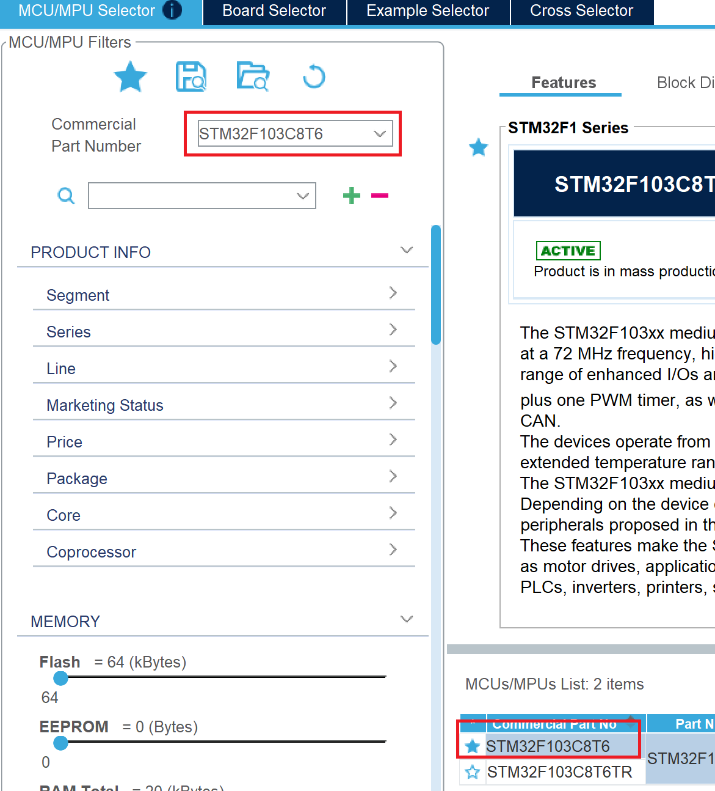
  2. System Core-SYS设置。DEBUG选择Serial Wire。
   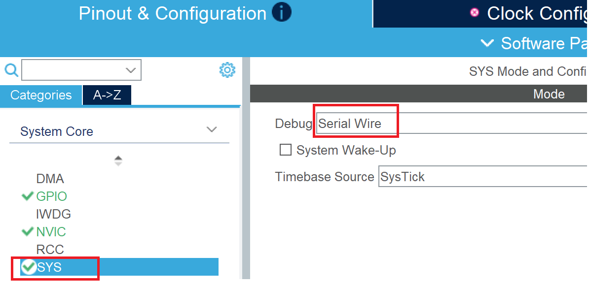
  3. Pin Out View界面，将PC13设置为GPIO_OUTPUT。
   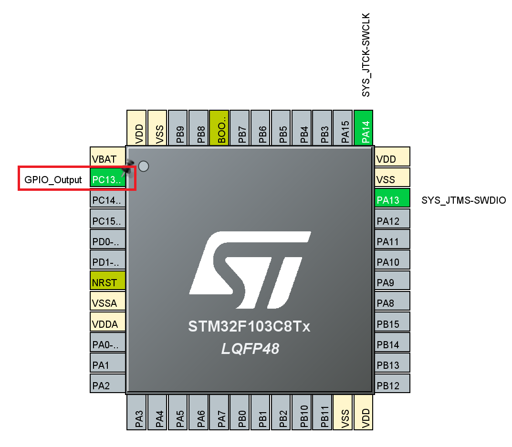
  4. 在GPIO选项卡中，将PC13的GPIO mode设置为：Output Push Pull。
   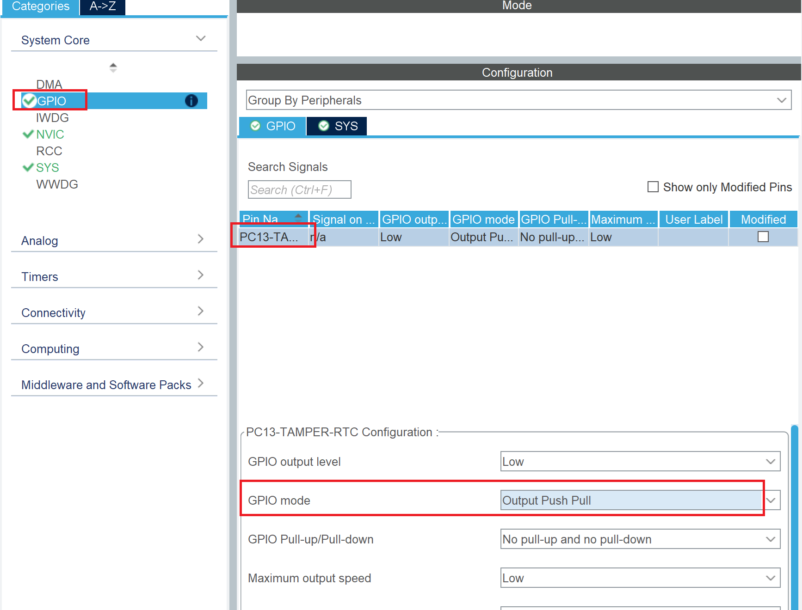
  5. 在Project Manager选项卡中，输入Project Name，ToolChain/IDE选择：MDK-ARM。点击GENERATE CODE，生成代码。
   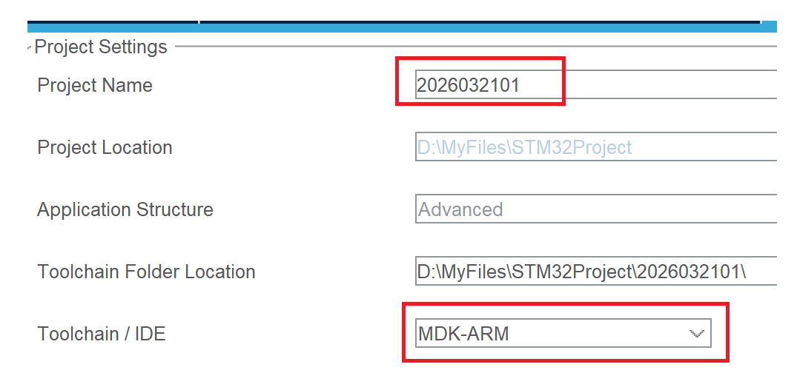
  6. 在Keil软件中，先Build，再Load。
   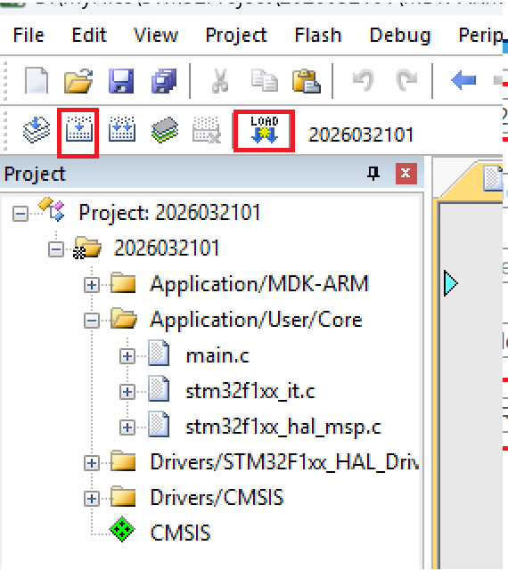
## 第3课 [GPIO]引脚分布
   1. 引脚分类：特殊功能引脚（有颜色）和可编程引脚（灰色）
   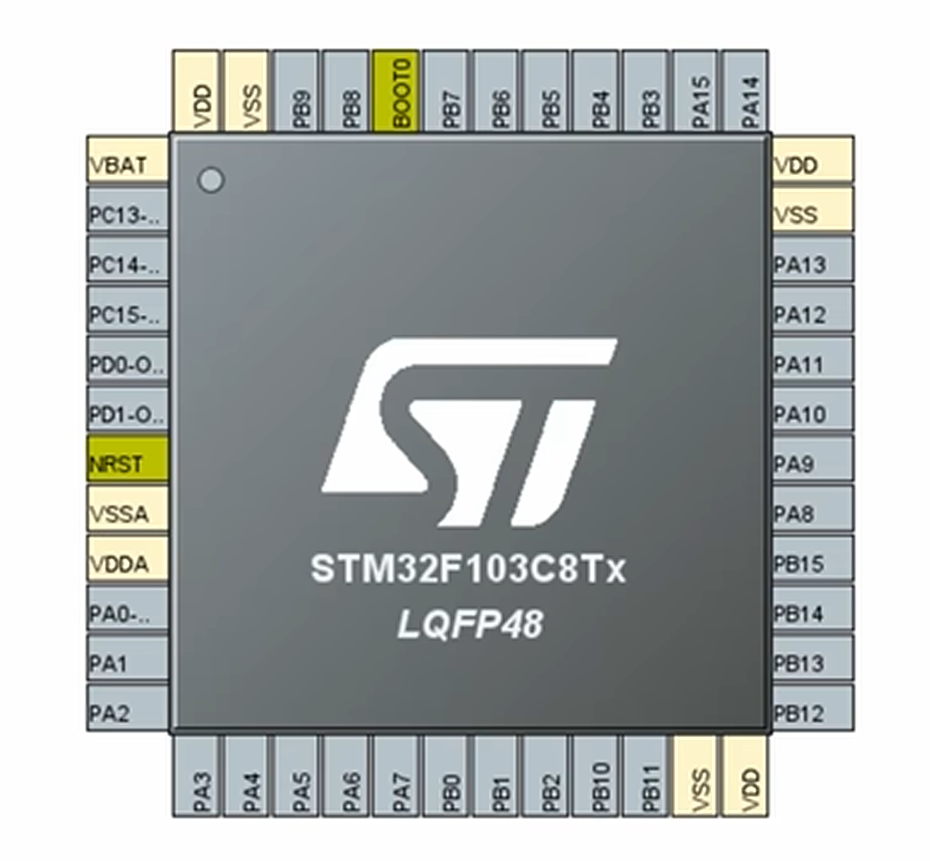
   2. 特殊功能引脚的功能。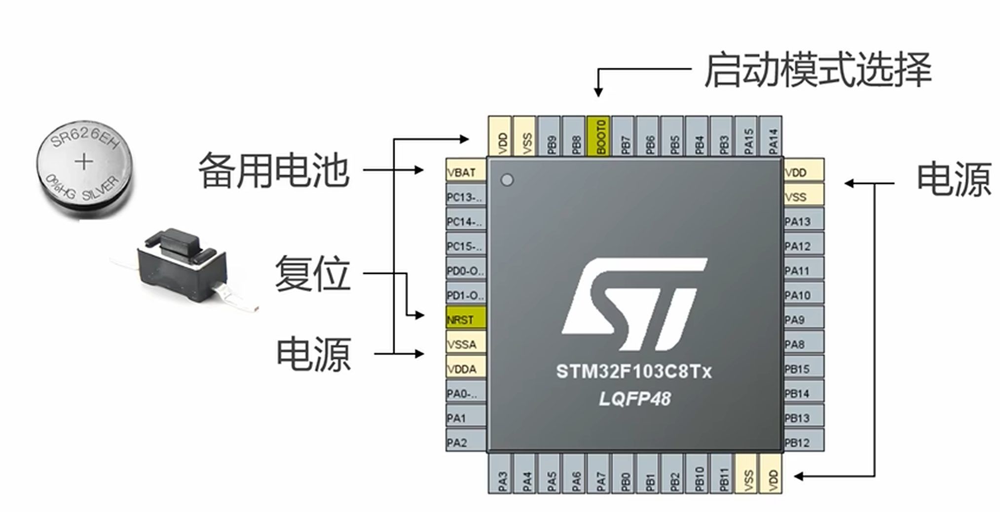  
   3. 普通引脚：PA，PB，PC，PD
## 第4课 [GPIO]IO复用和重映射
   普通引脚除了用作普通IO接口使用，还有一些其他的功能。具体什么功能，后面再说。
## 第5课 [GPIO]4种输出模式
   1. GPIO的输出分为四种模式：推挽、开漏、复合推挽、复合开漏
   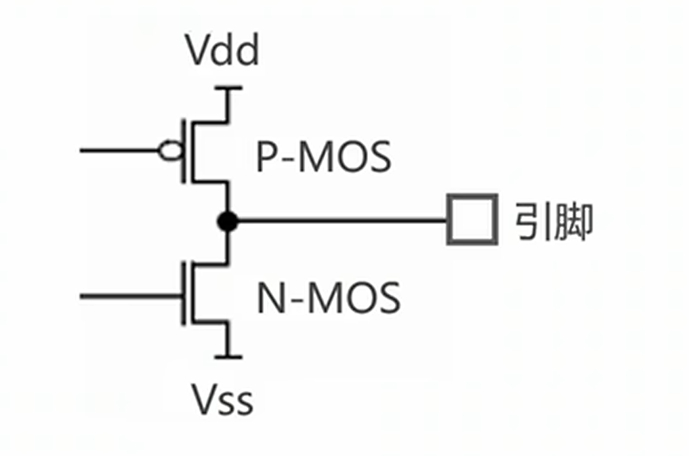
   2. 推挽：两个开关都起作用，一个同时另一个断开。输入为1时，上通下断；输出为0时，上断下通。
   3. 开漏：只有下面的N-MOS起作用。输入为1时，下断；输出为0时，下通。
   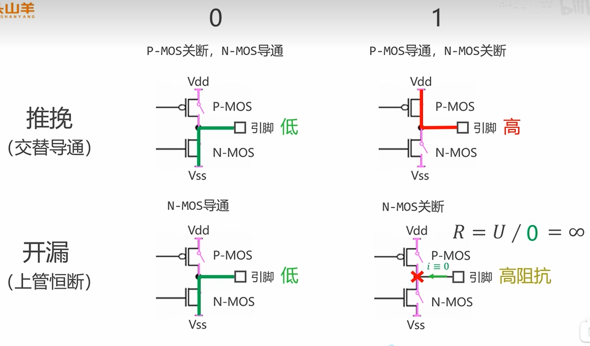
   4. 复合推挽和复合开漏后面再说。
## 第6课 [GPIO]IO最大输出速度
    1. 在GPIO选项卡中设置最大输出速度，它是输出电平的最大切换频率。
   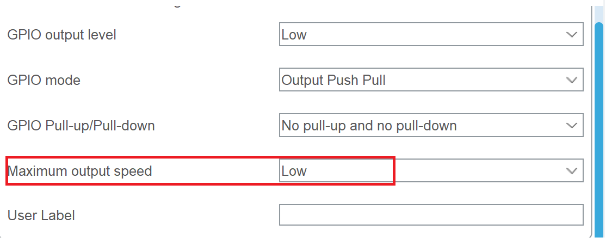
  2. 分为三档。低速：2MHz；中速：10MHz；高速：50MHz
## 第7课 [GPIO]闪灯实验
### 一、HAL库函数
1. IO口输出高/电平
   ```c
   void HAL_GPIO_WritePin(GPIO_TypeDef *GPIOx, uint16_t GPIO_Pin, GPIO_PinState PinState)
   ```
   举例：  
   ```c
   HAL_GPIO_WritePin(GPIOC, GPIO_PIN_13, GPIO_PIN_SET);  //将PC13口设置为高电平
   HAL_GPIO_WritePin(GPIOC, GPIO_PIN_13, GPIO_PIN_RESET);  //将PC13口设置为低电平
   ```
2. 滴答延时器
   ```c
   void HAL_Delay(__IO uint32_t Delay)
   ```
   举例:
   ```c
   HAL_Delay(500)  //延迟500ms
   ```
### 二、实验:闪灯实验
```c
伪代码：
while(1){
   PC13 = 0; //PC13口设置为低电平，点亮开漏接口的灯
   延时0.5S；//延时0.5S；
   PC13 = 1；//PC13口设置为高电平，熄灭开漏接口的灯
   延时0.5S；//延时0.5S；
}
```
## 第8课 使用BOOTLOADER清除程序
略
## 第9课 [GPIO]4种输入模式
   1. 4种输入模式：上拉、下拉、悬空（高阻）、模拟。上拉、下拉、悬空三种模式的核心：测量接口与Vss之间的电压是高电平还是低电平，一定记得可以省略上拉或者下拉电阻，但是输入开关端的接地或者接电源不能省略。上拉时，开关的另一端接地；下拉时，另一端接高电平。
   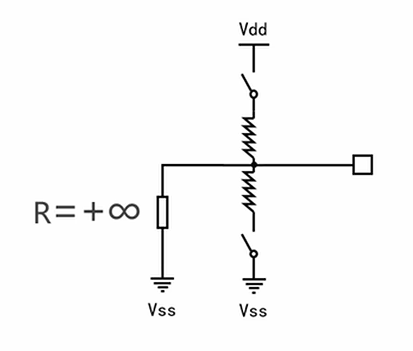
   2. 上拉接法。开关接通时，输入为0；开关断开时，输入为1.
   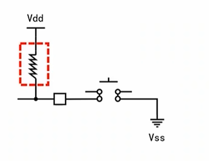
   3. 下拉。开关接通时，输入为1；开关断开时，输入为0。
   4. 悬空：可以自己接上拉电阻或者下拉电阻，但是记得与STM32的Vss共地。
   5. 模拟信号用作ADC，后面再说。
## 第10课 [GPIO]按钮实验
### 一、HAL库函数
1. 读取引脚高低电平函数HAL_GPIO_ReadPin
```c
GPIO_PinState HAL_GPIO_ReadPin(GPIO_TypeDef *GPIOx, uint16_t GPIO_Pin)//返回两种状态：GPIO_PIN_SET和GPIO_PIN_RESET
举例：
HAL_GPIO_ReadPin(GPIOA, GPIO_PIN_0)
```
### 二、按钮实验
```c
核心代码
while(1){
   if(HAL_GPIO_ReadPin(GPIOA, GPIO_PIN_9) == GPIO_PIN_SET)
   {
      HAL_GPIO_WritePin(GPIOC, GPIO_PIN_13, GPIO_PIN_SET); 
   }   
   else
   {
      HAL_GPIO_WritePin(GPIOC, GPIO_PIN_13, GPIO_PIN_RESET); 
   }

}

```


